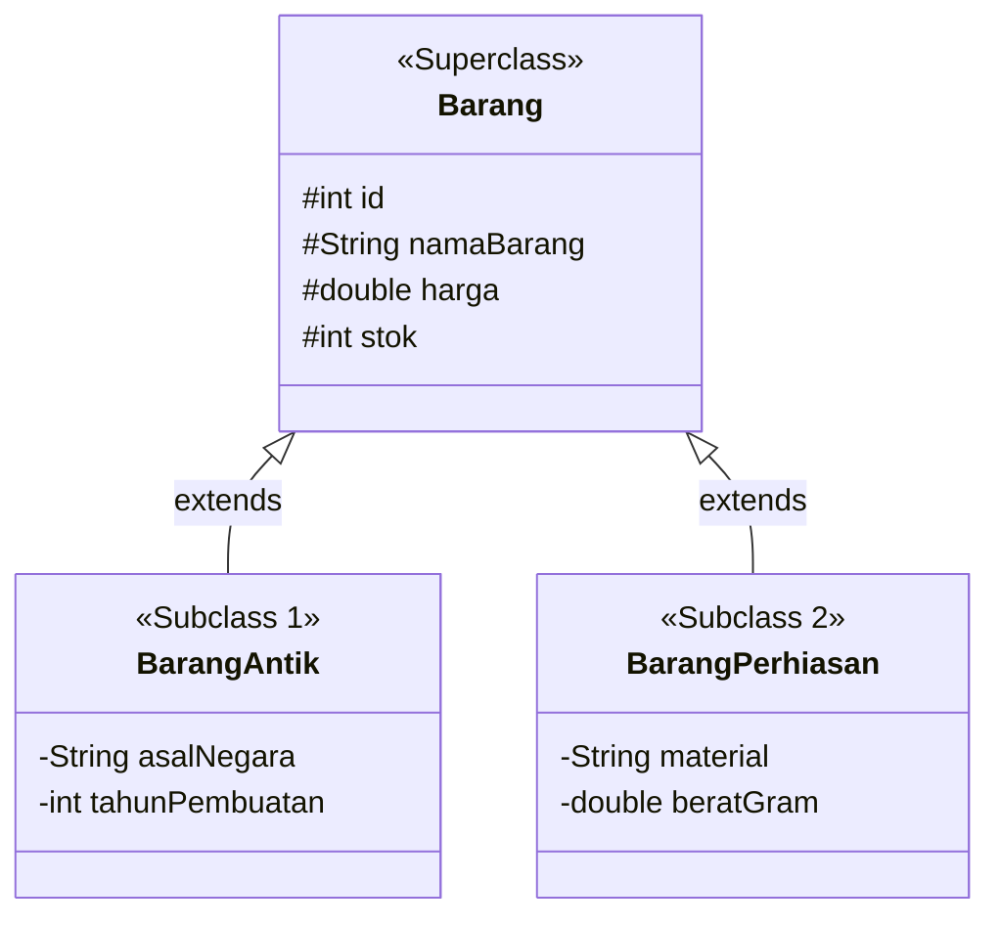
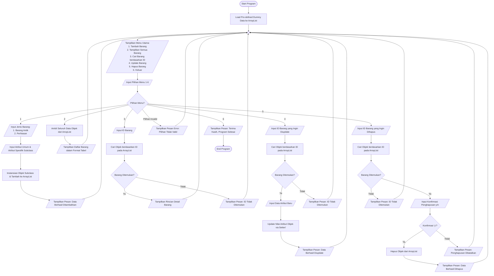

# Dokumentasi Program Mini Project 2 PBO
## Sistem Manajemen Inventaris Toko Barang Antik (Monarch Antiqu'e)

---

### Informasi Mahasiswa
* **Nama** : Mikhel Febian
* **NIM** : 2509116056
* **Kelas** : B
* **Angkatan** : 2025
* **Mata Kuliah** : Pemrograman Berbasis Objek
* **Tema Program** : Sistem Penjualan dan Inventaris Barang Antik
* **Nama Sistem** : Monarch Antiqu'e System
* **Repository** : [Minpro-2-PBO-ManajemenTokoAntik](https://github.com/Mikhelfebian/Minpro-2-PBO-ManajemenTokoAntik/tree/main)

---

### 1. Deskripsi Singkat Program
Monarch Antiqu'e System adalah aplikasi pengelolaan inventaris barang antik berbasis *Command Line Interface* (CLI) yang dikembangkan menggunakan bahasa pemrograman Java. Program ini dirancang untuk memudahkan admin etalase toko dalam mengelola data koleksi barang antik dan perhiasan melalui operasi *Create, Read, Update, dan Delete* (CRUD).

Pada versi Mini Project 2 ini, arsitektur sistem telah disempurnakan dengan menerapkan prinsip-prinsip Pemrograman Berbasis Objek (*Object-Oriented Programming*) meliputi **Encapsulation**, **Inheritance**, **Polymorphism**, serta pemisahan struktur package berdasarkan pola arsitektur **Model-View-Controller (MVC)**.

---

### 2. Spesifikasi Lingkungan Pengembangan
* **Bahasa Pemrograman** : Java (JDK 17+)
* **Integrated Development Environment (IDE)** : Apache NetBeans
* **Struktur Data Memory** : `java.util.ArrayList`
* **Arsitektur Program** : Model-View-Controller (MVC)

---

### 3. Struktur Entitas dan Penerapan Inheritance

Sistem mengimplementasikan prinsip *Inheritance* (Pewarisan) dengan `Barang` sebagai *Superclass* serta `BarangAntik` dan `BarangPerhiasan` sebagai *Subclass*.



#### 3.1 Superclass: `Barang`
Menampung atribut dan perilaku umum yang dimiliki oleh seluruh entitas barang di toko.

| Modifikator Akses | Tipe Data | Nama Atribut | Deskripsi |
| :--- | :--- | :--- | :--- |
| `protected` | `int` | `id` | Identifikasi unik barang (*auto-increment*). |
| `protected` | `String` | `namaBarang` | Nama barang antik atau perhiasan. |
| `protected` | `double` | `harga` | Nominal harga barang dalam satuan Rupiah. |
| `protected` | `int` | `stok` | Ketersediaan jumlah unit barang. |

#### 3.2 Subclass 1: `BarangAntik` (Extends `Barang`)
Menampung data barang antik umum dengan atribut spesifik histori.

| Modifikator Akses | Tipe Data | Nama Atribut | Deskripsi |
| :--- | :--- | :--- | :--- |
| `private` | `String` | `asalNegara` | Negara asal ditemukannya objek antik. |
| `private` | `int` | `tahunPembuatan` | Tahun pembuatan atau estimasi usia barang. |

#### 3.3 Subclass 2: `BarangPerhiasan` (Extends `Barang`)
Menampung data barang koleksi perhiasan antik dengan atribut spesifik material fisik.

| Modifikator Akses | Tipe Data | Nama Atribut | Deskripsi |
| :--- | :--- | :--- | :--- |
| `private` | `String` | `material` | Jenis material pembuat perhiasan (Emas, Perak, dsb). |
| `private` | `double` | `beratGram` | Berat fisik perhiasan dalam satuan gram. |

---

### 4. Alur Kerja Sistem


1. **Inisialisasi Data (`Read Pre-loaded Data`)** :
   Sistem secara otomatis mengisikan beberapa data awal (*dummy data*) ke dalam `ArrayList` saat aplikasi dijalankan, sehingga fitur penampilan data langsung dapat diuji tanpa pengisian dari awal.
2. **Tambah Barang (`Menu 1`)** :
   Pengguna memilih tipe entitas yang ingin ditambahkan (`BarangAntik` atau `BarangPerhiasan`). Sistem meminta input detail sesuai tipe dengan disertai contoh format (*hint*).
3. **Tampilkan Semua Barang (`Menu 2`)** :
   Sistem menampilkan daftar barang dalam tabel terformat beserta detail atribut khusus dari masing-masing tipe kelas.
4. **Cari Barang Berdasarkan ID (`Menu 3`)** :
   Pengguna menginput ID barang. Sistem melakukan pencarian linier dan menampilkan entitas jika ditemukan.
5. **Update Barang (`Menu 4`)** :
   Sistem menampilkan data yang tersimpan berdasarkan ID, lalu menerima input pembaruan atribut umum dan atribut khusus subclass.
6. **Hapus Barang (`Menu 5`)** :
   Sistem meminta masukan ID barang yang akan dihapus, lalu meminta konfirmasi penghapusan (`y/n`) sebelum memuat operasi hapus.

---

### 5. Penjelasan Penerapan Prinsip PBO Wajib

#### 5.1 Encapsulation dan Access Modifier
* Seluruh variabel instans dikapsulasi ketat dengan modifikator `protected` pada *Superclass* dan `private` pada *Subclass*.
* Akses maupun pembacaan variabel dikendalikan melalui metode *Getter* dan *Setter*.
* Metode *Setter* dilengkapi dengan validasi data internal (misal: penolakan string kosong dan angka bernilai negatif dengan melempar `IllegalArgumentException`).

#### 5.2 Inheritance
* Implementasi hirarki dilakukan dengan membuat *Superclass* `Barang.java` yang diturunkan kepada dua *Subclass* yaitu `BarangAntik.java` dan `BarangPerhiasan.java`.
* *Subclass* menggunakan kata kunci `super` pada konstruktor untuk memanggil konstruktor dari *Superclass*.

#### 5.3 Validasi Input Usability
* Penanganan masukan pengguna terpusat pada kelas utilitas `Validator.java` untuk mengantisipasi *exception* masukan tipe data salah (seperti `NumberFormatException`).
* Setiap prompt instruksi inputan pada `MainView.java` dilengkapi dengan contoh format masukan (*hint*) untuk memperjelas ekspektasi masukan bagi pengguna.

---

### 6. Penjelasan Penerapan Nilai Tambah

#### 6.1 Arsitektur Model-View-Controller (MVC)
Kode program dipisahkan secara modular ke dalam struktur *package* terorganisir berikut:

```text
com.mycompany.tokoantik
├── model/
│   ├── Barang.java             (Superclass Entitas Utama)
│   ├── BarangAntik.java        (Subclass Entitas Barang Antik)
│   └── BarangPerhiasan.java    (Subclass Entitas Perhiasan)
├── controller/
│   └── BarangController.java   (Logika Bisnis, CRUD, & Pengelolaan ArrayList)
├── view/
│   └── MainView.java           (Interface CLI dan Alur Interaksi Pengguna)
├── util/
│   └── Validator.java          (Utility Pemrosesan dan Validasi Input)
└── Main.java                   (Kelas Utas Entry Point Utama)
```

#### 6.2 Polymorphism
* **Method Overriding** :
  Metode `getJenisBarang()` dan `toString()` dari kelas `Barang` di-*override* pada kelas `BarangAntik` dan `BarangPerhiasan`. Hal ini memungkinkan pencetakan tabel informasi barang secara dinamis menyesuaikan tipe objek pada run-time.
* **Method Overloading** :
  Kelas `BarangController` mengimplementasikan *method overloading* pada metode penambahan barang:
  - `tambahBarangAntik(String nama, double harga, int stok, String asal, int tahun)`
  - `tambahBarangPerhiasan(String nama, double harga, int stok, String material, double berat)`

---

### 7. Tangkapan Layar Eksekusi Program

#### 7.1 Tampilan Menu Utama dan Read Data Bawaan


#### 7.2 Tambah Data Baru dengan Petunjuk Format Input


#### 7.3 Update Data Barang Spesifik Subclass


#### 7.4 Hapus Data Barang


